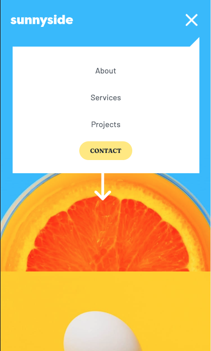
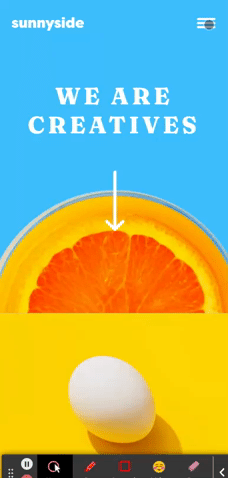

# Frontend Mentor - Sunnyside agency landing page solution

This is a solution to the [Sunnyside agency landing page challenge on Frontend Mentor](https://www.frontendmentor.io/challenges/sunnyside-agency-landing-page-7yVs3B6ef). Frontend Mentor challenges help you improve your coding skills by building realistic projects.

## Table of contents

- [Overview](#overview)
  - [The challenge](#the-challenge)
  - [Screenshot](#screenshots)
  - [Links](#links)
- [My process](#my-process)
  - [Built with](#built-with)
  - [What I learned](#what-i-learned)
  - [Continued development](#continued-development)
- [Author](#author)
- [Acknowledgments](#acknowledgments)

## Overview

### The challenge

Users should be able to:

- View the optimal layout for the site depending on their device's screen size
- See hover states for all interactive elements on the page

### Screenshots

### Links

- Solution URL: [Add solution URL here](https://github.com/austenpturner/sunnyside-agency)
- Live Site URL: [Add live site URL here](https://austenpturner.github.io/sunnyside-agency/)

## My process

### Built with

- React via Vite
- SCSS
- CSS Grid
- Mobile-first workflow

### What I learned

I've always been a flexbox gal and do not have much experience with grid. I decided it was time to start learning and that this would be the perfect project for it! I got comfortable with setting up rows and columns, centering and justifying items inside, and setting item columns and row starts/ends. There's so much more to learn and I plan to continue to explore and use grid.

### Continued development

I'd like to clean up my SCSS and make better use of CSS grid.

Make the social media icons change to white on hover.

Add some animations!

## Author

- Website - [Austen P. Turner](https://austenpturner.github.io/portfolio/)
- Frontend Mentor - [@austenpturner](https://www.frontendmentor.io/profile/austepturner)
- Github - [@austenpturner](https://github.com/austenpturner)

## Acknowledgments

Kevin Powell's YouTube video ["Basic, Intermediate & Pro animated hamburger icons"](https://www.youtube.com/watch?v=R00QiudbD4Y&t=19s)
